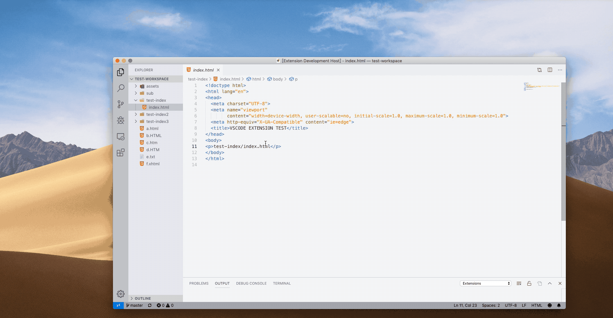

# Open In Default Browser

A VSCode extension to fast open html file in browser.

## Supported features

1. Provide "Open In Default Browser" menu for html files on the explorer and on the editor, it can open this html file with the default browser.
2. You can also use the shortcut `ctrl + 1` (Windows) / `command + 1` (Mac)
3. It uses a local http server to open html file
4. Support multi-languauge: 
   - English (en)
   - Simplified Chinese (zh-cn)
   - Traditional Chinese (zh-tw)
   - Japanese (ja)
   - French (fr)
   - Korean (ko)
   - Russian (ru)
   - Portuguese (pt)
   - Turkish (tr)
   - German (de)
   - Spanish (es)
   - Hungarian (hu)
   - Italian (it)
   - Bulgarian (bg)

## Settings Options

This extension contributes the following variables to the [settings](https://code.visualstudio.com/docs/getstarted/settings):

- `openInDefaultBrowser.run.openWithLocalHttpServer`: (true/false) Whether to open with local http server, default `true`

## License

[MIT](./LICENSE)
